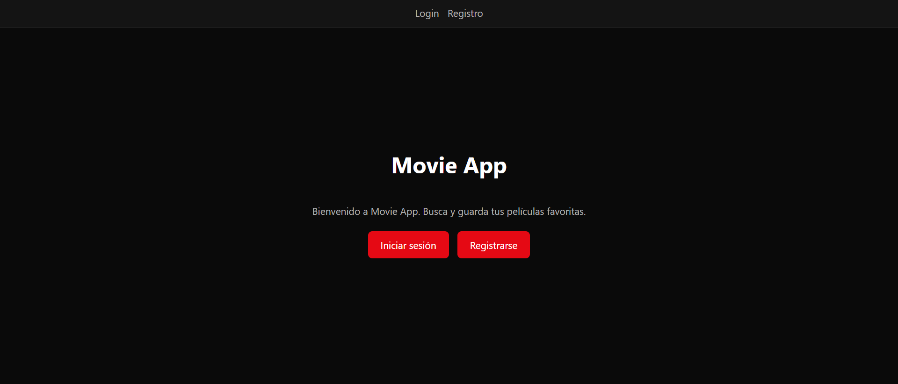
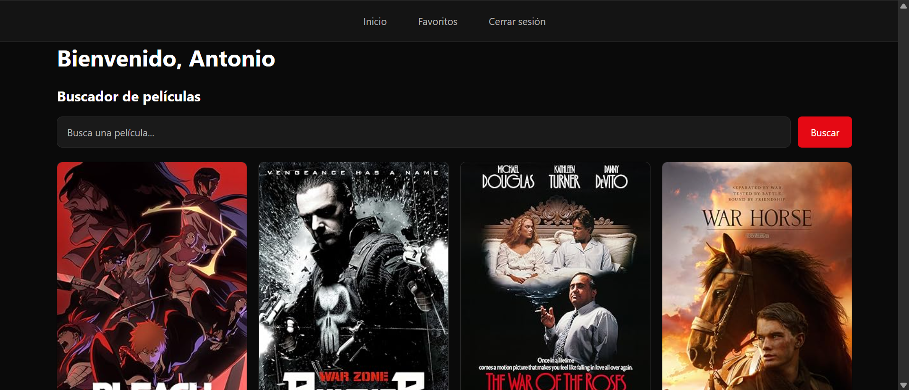
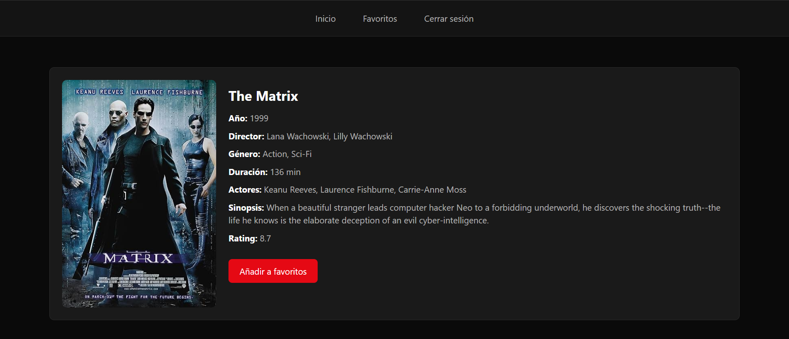

# grupo2-proyecto-backend-film-app



## Descripción

Movie App es una aplicación web de búsqueda y gestión de películas. Permite a los usuarios buscar películas, guardar sus favoritas y ver el detalle de cada una. Los administradores pueden gestionar películas y usuarios desde su panel de control.

---

## Tecnologías

**Backend:**
- Node.js
- Express.js
- Sequelize + PostgreSQL (usuarios y favoritos)
- Mongoose + MongoDB (películas)
- JWT + bcryptjs (autenticación)
- EJS (motor de plantillas)
- Helmet + Cookie-parser

**Frontend:**
- HTML / CSS / JavaScript vanilla
- EJS

**Herramientas:**
- Swagger / OpenAPI (documentación)
- Morgan (logging)
- Dotenv

---

## Instalación

```bash
# Clonar el repositorio
git clone https://github.com/BV-Works/grupo2-proyecto-backend-film-app

# Entrar en el proyecto
cd grupo2-proyecto-backend-film-app

# Instalar dependencias
npm install
```

---

## Variables de entorno

Crea un archivo `.env` en la raíz del proyecto con las siguientes variables:

```
PORT=3000

# PostgreSQL
DB_HOST=tu_host
DB_USER=tu_usuario
DB_DATABASE=tu_base_de_datos
DB_PORT=5432
DB_PASSWORD=tu_contraseña

# MongoDB
MONGO_URI=tu_uri_de_mongo

# JWT
ACCESS_TOKEN_SECRET=tu_clave_secreta

# OMDB
OMDB_API_KEY=tu_api_key
```

---

## Demo

 [https://grupo2-proyecto-backend-film-app-1.onrender.com/home](https://grupo2-proyecto-backend-film-app-1.onrender.com/home)
---

## Cómo arrancarlo

```bash
npm start
```

El servidor arrancará en `http://localhost:3000`

---

## Capturas de pantalla

| Dashboard | Detalle de película |
|-----------|-------------------|
|  |  |

---

## Endpoints API

### Autenticación

| Método | Endpoint | Descripción | Auth |
|--------|----------|-------------|------|
| POST | /api/signup | Registro de usuario | ❌ |
| POST | /api/login | Login | ❌ |
| POST | /api/logout | Logout | ✅ |

### Usuarios

| Método | Endpoint | Descripción | Auth |
|--------|----------|-------------|------|
| GET | /api/users | Obtener todos los usuarios | Admin |
| GET | /api/user/:id | Obtener un usuario | Admin |
| PUT | /api/user/:id | Editar usuario | Admin |
| DELETE | /api/user/:id | Borrar usuario | Admin |

### Películas

| Método | Endpoint | Descripción | Auth |
|--------|----------|-------------|------|
| GET | /api/films | Buscar película | ✅ |
| GET | /api/films/random | Películas aleatorias | ❌ |
| GET | /api/films/admin | Listado admin | Admin |
| GET | /api/films/admin/:id | Película por id | Admin |
| POST | /api/films | Crear película | Admin |
| PUT | /api/films/:id | Editar película | Admin |
| DELETE | /api/films/:id | Borrar película | Admin |

### Favoritos

| Método | Endpoint | Descripción | Auth |
|--------|----------|-------------|------|
| GET | /api/favorites | Obtener favoritos | ✅ |
| POST | /api/favorites | Añadir favorito | ✅ |
| DELETE | /api/favorites/:id | Borrar favorito | ✅ |

---

## Estructura del proyecto

```
├── config/
│   ├── db_mongo.js
│   └── db_pg.js
├── docs/
│   ├── openapi.yaml
│   └── postman.json
├── public/
│   ├── css/
│   │   └── style.css
│   ├── img/
│   └── js/
│       ├── admin-movies.js
│       ├── admin-users.js
│       ├── dashboard.js
│       ├── film-detail.js
│       ├── login.js
│       └── signup.js
└── src/
    ├── controllers/
    │   ├── auth.controller.js
    │   ├── favorites.controller.js
    │   ├── films.controller.js
    │   └── users.controller.js
    ├── middlewares/
    │   └── auth.middleware.js
    ├── models/
    │   ├── Films.js
    │   ├── User.js
    │   ├── favorites.models.js
    │   └── index.js
    ├── routes/
    │   ├── auth.routes.js
    │   ├── favorites.routes.js
    │   ├── films.routes.js
    │   ├── users.routes.js
    │   └── view.routes.js
    ├── utils/
    │   ├── fetch-movies.utils.js
    │   ├── movie-normalizer.js
    │   ├── omdb.helper.js
    │   └── scraping.utils.js
    ├── views/
    │   ├── partials/
    │   │   ├── footer.ejs
    │   │   ├── header.ejs
    │   │   └── menu.ejs
    │   ├── admin-movies.ejs
    │   ├── admin-users.ejs
    │   ├── dashboard.ejs
    │   ├── film-detail.ejs
    │   ├── index.ejs
    │   ├── login.ejs
    │   └── signup.ejs
    └── app.js
```

---

## Documentación API

Con el servidor arrancado entra en:

```
http://localhost:3000/docs
```

---

## Autores

| Nombre |
|--------|
| Jaime Rubio| 
| Pablo Vecilla| 
| Antonio Soler| 
| Elena González |